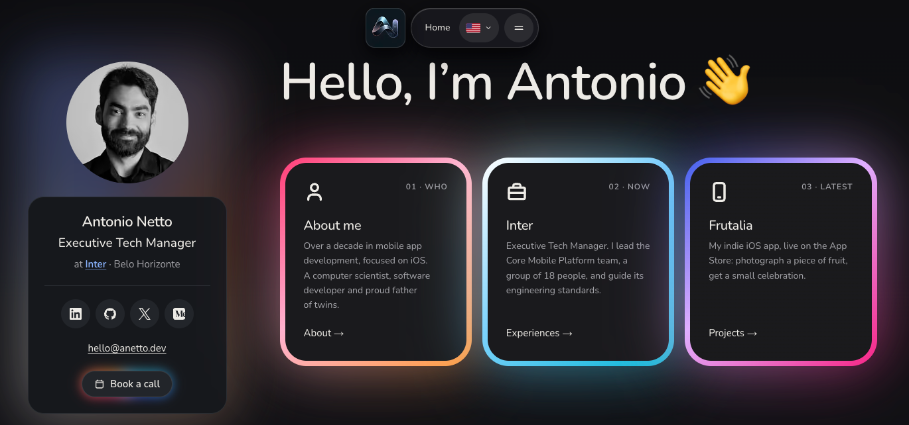

# anetto.dev

[](https://github.com/anettodev/anetto.dev/actions/workflows/ci.yml)
[](https://github.com/anettodev/anetto.dev/actions/workflows/deploy.yml)
[](https://astro.build)
[](LICENSE)

> The personal site of Antonio Netto, Executive Tech Manager at Inter and iOS engineer since 2011.

**Live:** [https://anetto.dev](https://anetto.dev)



## About

The site gathers my work in one place: experience, projects, writing, AI usage and bookmarks. It's a static [Astro](https://astro.build) site in English, Portuguese (pt-BR) and Spanish, with no UI framework: pages render to HTML at build time, and small custom elements add the interactive parts.

## Features

- **Identity card and navigation island:** a sticky card with contact links and "Book a call", and a floating glass menu bar with the language and theme switchers.
- **Home intro:** on the first visit of a session, the logo plays and the card turns into place (any input skips it; never with reduced motion).
- **Experiences:** a company timeline with every role.
- **Projects:** pinned apps and a filterable list.
- **Blog:** Evernote notes (each with its own page, a table of contents, Share and Listen), public gists and Medium stories, with search, filters and paging. The notes have an RSS feed at [`/rss.xml`](https://anetto.dev/rss.xml).
- **Listen:** notes and About can be read aloud, in the visitor's device voice or in a recording of my cloned voice (ElevenLabs), in the page's language.
- **AI and GitHub activity:** usage and contribution calendars from daily data snapshots.
- **Recommendations:** a YouTube playlist, Spotify podcasts and an Apple Music playlist under the card.
- **Bookmarks:** my public Raindrop collections.
- **Themes and languages:** dark and light themes (system default, with a toggle), and every page in three languages with hreflang alternates.
- **Fast and private:** about 8 KB of JavaScript on Home (gzipped), images served from the site itself (the YouTube, Spotify and Apple Music players load only when opened), and cookie-free analytics ([GoatCounter](https://www.goatcounter.com)).

## Tech stack

- [Astro](https://astro.build) 7 with TypeScript, static output
- [`@astrojs/sitemap`](https://docs.astro.build/en/guides/integrations-guide/sitemap/) and [`@astrojs/rss`](https://docs.astro.build/en/recipes/rss/)
- ESLint (typescript-eslint) and Prettier
- GitHub Actions and GitHub Pages
- Node.js 24 (see `.nvmrc`)

## Quick start

```bash
git clone https://github.com/anettodev/anetto.dev.git
cd anetto.dev
npm ci
npm run dev        # http://localhost:4321
```

| Command                | What it does                                   |
| ---------------------- | ---------------------------------------------- |
| `npm run dev`          | Development server                             |
| `npm run build`        | Type check (`astro check`), then build `dist/` |
| `npm run preview`      | Serve the production build                     |
| `npm run lint`         | ESLint                                         |
| `npm run format:check` | Prettier check (`npm run format` writes)       |

## Data snapshots

The build never calls an outside service. Each data source is a committed snapshot in `src/data/` (with images in `src/assets/`), written by a script:

| Command                      | Snapshot                                           | Needs                                |
| ---------------------------- | -------------------------------------------------- | ------------------------------------ |
| `npm run github:refresh`     | GitHub contribution calendar                       | `GITHUB_TOKEN` (or the `gh` login)   |
| `npm run ai:refresh`         | AI usage (tokscale public profile)                 | nothing                              |
| `npm run bookmarks:refresh`  | Public Raindrop bookmarks                          | nothing                              |
| `npm run blog:refresh`       | Medium stories and public gists                    | nothing (`GITHUB_TOKEN` optional)    |
| `npm run music:refresh`      | Apple Music playlist title and cover               | nothing                              |
| `npm run podcasts:refresh`   | Spotify shows                                      | `SPOTIFY_*` (once: `podcasts:login`) |
| `npm run youtube:refresh`    | YouTube playlist videos                            | `YOUTUBE_API_KEY`                    |
| `npm run notes:write -- <f>` | Evernote notes, from an export of the tagged notes | an export file                       |
| `npm run notes:audio`        | Voice recordings of opted-in notes                 | `ELEVENLABS_API_KEY`                 |
| `npm run pages:audio`        | Voice recordings of About, per language            | `ELEVENLABS_API_KEY`                 |

Keys come from the environment and are never committed.

## Project structure

```
anetto.dev/
├── .github/workflows/   # ci.yml (checks) and deploy.yml (build, refresh, deploy)
├── public/              # Static files: brand, icons, audio
├── scripts/             # Data refreshes, notes, voice recordings, icons
├── src/
│   ├── assets/          # Images Astro optimizes (covers, logos, notes)
│   ├── components/      # .astro components
│   ├── content/         # Pages, companies and projects, per language
│   ├── data/            # Committed data snapshots
│   ├── i18n/            # Locales, routes and UI strings (en, pt, es)
│   ├── layouts/         # Base and Page
│   ├── lib/             # Site settings and helpers
│   ├── pages/           # Routes (one file per page, all languages)
│   ├── scripts/         # Client-side custom elements
│   └── styles/          # Tokens and global styles
├── astro.config.ts
├── DECISIONS.md         # Why each design and build choice was made
└── PLAN.md              # What's left to do
```

## Deployment

- **Every pull request** runs `ci.yml`: install, lint, format check, type check and build.
- **A push to `main`** runs `deploy.yml`, which builds the site and deploys it to GitHub Pages at [anetto.dev](https://anetto.dev).
- **Every day at 06:23 UTC** (and on manual runs), `deploy.yml` first refreshes the data snapshots and commits what changed, then deploys. A refresh that fails never blocks the deploy; the site keeps its last data.

Evernote notes and voice recordings are refreshed by hand.

## License

The code is licensed under the MIT License; see [LICENSE](LICENSE).

## Contact

- Website: [anetto.dev](https://anetto.dev)
- Email: [hello@anetto.dev](mailto:hello@anetto.dev)
- GitHub: [@anettodev](https://github.com/anettodev)

---

**Note:** This is a personal site. Feel free to use the code structure as inspiration for your own, but please don't use my personal content or branding.
